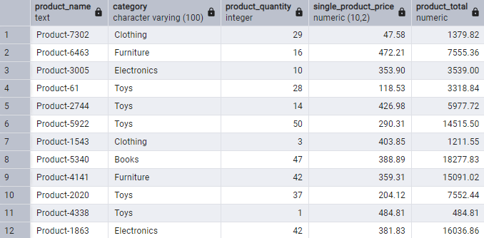
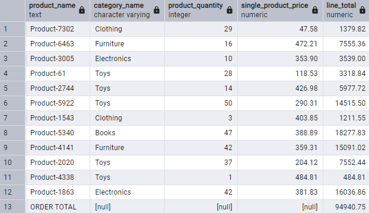
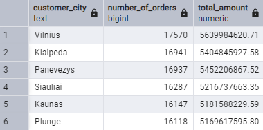

## How to run
- ```git clone https://https://github.com/paplauskis/adform-task.git```
- ```cd adform-task```
- ```docker-compose up -d```
- ```docker exec -it adform-task psql -U user -d "adform-task"```

### Query examples
- get_order_items (int as argument)



- get_order_total_amount (int as argument)


- get_order_invoice (int as argument)



- get_order_report_city (with city argument)


- get_order_report_no_city (without city argument)



### Comments
- Added ```created_at``` row, can be useful for some queries later, but not needed right now
- Created additional ```category``` table, so that DB follows normalization principles and if categories need to be changed
- Added ```UNIQUE``` and ```NOT NULL``` constraints where I thought rows must be unique and have a value
- Shoud have added checks to ```product.price``` and ```order_item.quantity``` to ensure they were positive values and quantity isn't something like one million, but time was tight (will add them later if possible)
- Inserted sample data using ```generate_series```, felt like this was the most convenient way
- Created function ```random_products_count``` to produce random product count from 1 to 100, because ```random()``` did not generate different values in ```JOIN``` subquery when inserting data into order_item
- ```order_report``` was taking over 3.5 seconds in older implementation, added aggregated order totals in CTE, removed ```DISTINCT```, which was probably the main culprit for the slow query speed; it now takes about 1.7s without city argument and 0.4s with city argument
- Other queries all take less than 0.3s, could probably make them faster, but as said time was tight. Will try to make them faster if I'll have time
- Added materialized view ```order_report_mv```, can be used instead of ```order_report``` query if strictly accurate data is not mandatory, cause the query isn't the fastest
- Tried speeding up queries by adding indexes to some rows, but there weren't big increases in speed; PostgreSQL automatically added indexes itself to some rows

- My thougts when doing this task were to make sure all tables, data seeded, queries were working correcly and performance was not awful before jumping into other sub-tasks.  
